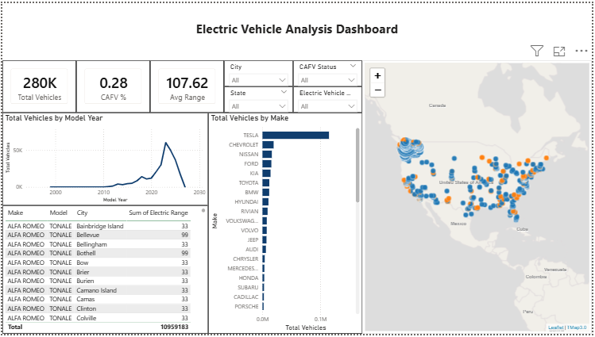

# Electric Vehicle Analysis Dashboard

## Project Description
This Power BI dashboard provides an interactive visualization platform to analyze electric vehicle (EV) data across various cities and states. It helps users explore key metrics such as total EVs, CAFV percentage, average driving range, and trends by model year and manufacturer.

## Key Features
- Summary cards showing total vehicles, CAFV percentage, and average range.
- Filters for city, state, CAFV status, and vehicle type to customize views.
- Line chart visualizing the number of EVs by model year.
- Bar chart displaying EV distribution by vehicle make.
- Detailed data table with vehicle make, model, city, and electric range.
- Geographical map plotting EV locations across North America.

## Screenshot

## How to Use
1. Install Power BI Desktop if you haven’t already: [Power BI Desktop](https://powerbi.microsoft.com/desktop/).
2. Open the provided Power BI file (.pbix).
3. Use the slicers and filters to adjust the data view according to your interests.
4. Interact with charts and maps to analyze EV distribution and trends.

## Data Source
Data used in this dashboard comes from official EV registration datasets and Clean Air Vehicle program reports.

## License
© 2026 Your Name. All rights reserved.

---

*This dashboard aims to assist policymakers, researchers, and EV enthusiasts in understanding electric vehicle adoption patterns.*
